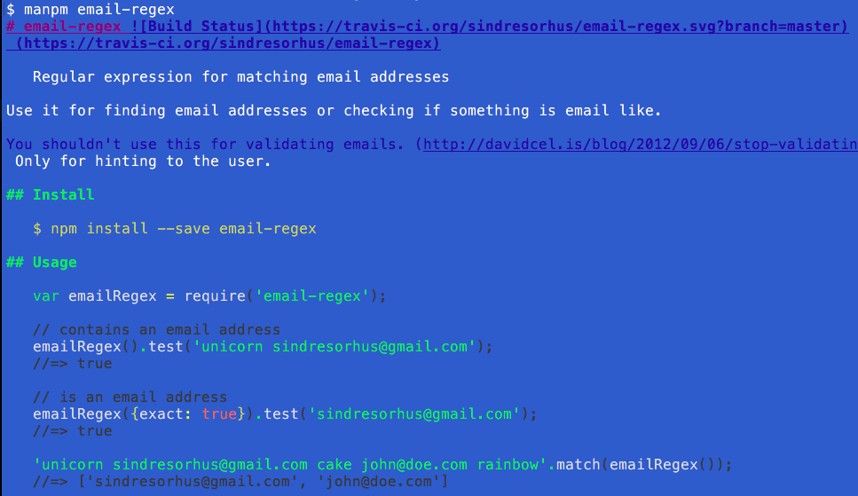

# manpm

> Shows the relevant part of NPM module's README file right in your terminal

[![NPM][manpm-icon] ][manpm-url]

[](https://github.com/bahmutov/manpm)
[](https://github.com/bahmutov/manpm)
[![CI][ci-badge] ][ci-url]
[![semantic-release][semantic-image] ][semantic-url]
[](https://github.com/bahmutov/npm-module-checklist#readme)
[CHECKLIST.md](CHECKLIST.md)

[manpm-icon]: https://nodei.co/npm/manpm.png?downloads=true
[manpm-url]: https://npmjs.org/package/manpm
[ci-badge]: https://travis-ci.org/bahmutov/manpm.png?branch=master
[ci-url]: https://travis-ci.org/bahmutov/manpm
[semantic-image]: https://img.shields.io/badge/%20%20%F0%9F%93%A6%F0%9F%9A%80-semantic--release-e10079.svg
[semantic-url]: https://github.com/semantic-release/semantic-release

## Badge

If you module has API well-described in the README, and `manpm <text>` works well,
consider adding the following `manpm compatible` badge to your README. Here is the markdown
for both variants: words or unicode symbols

```
[](https://github.com/bahmutov/manpm)
[](https://github.com/bahmutov/manpm)
```

## Install

    npm install -g manpm

## Show entire package or github readme

You can give NPM package name (like `manpm`), GitHub user / repo pair (like `bahmutov/manpm`) or
full GitHub url (like `https://github.com/bahmutov/object-fitter` or `git@github.com:bahmutov/object-fitter.git`).

    manpm <package name | github repo>

For example `manpm email-regex` will render the README from
[email-regex](https://www.npmjs.com/package/email-regex) package in you terminal



## Show part of the readme

    manpm <package name> [optional search text inside README]

If search text is provided, only a section of the README file with that text
(if found) will be displayed.


The following search features are implemented

- [x] find exact match in the section heading text
- [ ] fuzzy text match in the section heading text
- [ ] find exact match in the section body
- [ ] fuzzy text match in the section body

## Example: showing ES6 docs

There is a great GitHub repo [ES6 Overview in 350 Bullet Points](https://github.com/bevacqua/es6)
hosted at `https://github.com/bevacqua/es6`. Let us see how we can info for `WeakSets`

```
$ manpm bevacqua/es6 weaksets
# WeakSets

    * WeakSet is sort of a cross-breed between Set and WeakMap
    * A WeakSet is a set that can't be iterated and doesn't have enumeration methods
    * WeakSet values must be reference types
    * WeakSet may be useful for a metadata table indicating whether a reference is actively in use or not
    * Read ES6 WeakSets in Depth (https://ponyfoo.com/articles/es6-weakmaps-sets-and-weaksets-in-depth#es6-weaksets)

<sup>(back to table of contents) (#table-of-contents)</sup>
```

I added an alias to `manpm bevacqua/es6` command to my shell alias file for convenience

    $ echo 'alias es6-docs="manpm bevacqua/es6"' >> ~/.alias
    source ~/.alias
    es6-docs weaksets
    es6-docs array

## Example: showing ES6 features

Another great succint overview of ES6 features is
in [lukehoban/es6features](https://github.com/lukehoban/es6features). Let us add an alias

    echo 'alias es6-features="manpm lukehoban/es6features"' >> ~/.alias
    source ~/.alias

Let us look up the binary notation in ES6

    es6-features binary
    ### Binary and Octal Literals
    Two new numeric literal forms are added for binary (b) and octal (o).
        0b111110111 === 503 // true
        0o767 === 503 // true

## Pipe through less | more

You can pipe the output of `manpm` through "less" or "more" tools - but you will
lose the Markdown highlighting.

    manpm <package name> | less
    manpm <package name> | more

## Advanced

If there are problems and `manpm` is not working as expected, you can see the debug output.
Just run the tool with `DEBUG=manpm manpm ...` environment setting.

    $ DEBUG=manpm manpm object-fitter
    manpm fetching README for package +0ms object-fitter

## Inspired by the following tools

* [man-n](https://github.com/man-n/man-n)
* [npm-man](https://github.com/eush77/npm-man)
* [readme](https://www.npmjs.com/package/readme)

I wanted something a little more API friendly, like finding and showing
a README section that talked about a specific API method for example.

### Small print

Author: Gleb Bahmutov &copy; 2015

* [@bahmutov](https://twitter.com/bahmutov)
* [glebbahmutov.com](http://glebbahmutov.com)
* [blog](http://glebbahmutov.com/blog/)

License: MIT - do anything with the code, but don't blame me if it does not work.

Spread the word: tweet, star on github, etc.

Support: if you find any problems with this module, email / tweet /
[open issue](https://github.com/bahmutov/manpm/issues) on Github

## MIT License

Copyright (c) 2015 Gleb Bahmutov

Permission is hereby granted, free of charge, to any person
obtaining a copy of this software and associated documentation
files (the "Software"), to deal in the Software without
restriction, including without limitation the rights to use,
copy, modify, merge, publish, distribute, sublicense, and/or sell
copies of the Software, and to permit persons to whom the
Software is furnished to do so, subject to the following
conditions:

The above copyright notice and this permission notice shall be
included in all copies or substantial portions of the Software.

THE SOFTWARE IS PROVIDED "AS IS", WITHOUT WARRANTY OF ANY KIND,
EXPRESS OR IMPLIED, INCLUDING BUT NOT LIMITED TO THE WARRANTIES
OF MERCHANTABILITY, FITNESS FOR A PARTICULAR PURPOSE AND
NONINFRINGEMENT. IN NO EVENT SHALL THE AUTHORS OR COPYRIGHT
HOLDERS BE LIABLE FOR ANY CLAIM, DAMAGES OR OTHER LIABILITY,
WHETHER IN AN ACTION OF CONTRACT, TORT OR OTHERWISE, ARISING
FROM, OUT OF OR IN CONNECTION WITH THE SOFTWARE OR THE USE OR
OTHER DEALINGS IN THE SOFTWARE.

